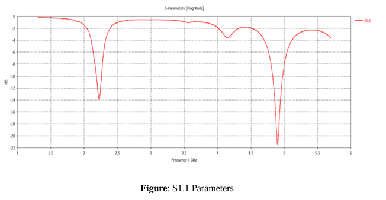

# Design Specification

## Frequency Range
- **Operating Frequency Range:** 2 GHz to 5.8 GHz (covers both 2.4 GHz and 5 GHz Wi-Fi bands)  
- **Defined Frequencies:** 2.4 GHz (Wi-Fi 6) and 5 GHz (Wi-Fi 6)  

## Substrate Details
- **Material:** FR-4 (lossy)  
- **Dielectric Constant (εr):** 4.3  
- **Loss Tangent:** 0.025  
- **Height (Hs):** 1.6 mm  
- **Copper Thickness (Hp):** 0.015 mm  

## Ground Plane Dimensions
- **Width (Wg):** 49 mm  
- **Length (Lg):** 46 mm  
- **Height (Hg):** 1 mm  

## Patch Dimensions
- **Patch Width (Wp):** 27.7 mm  
- **Patch Length (Lp):** 24.5 mm  
- **Patch Height (Hp):** 0.015 mm (copper thickness)  

## Microstrip Feed Line
- **Feed Line Width (Wo):** 3.137 mm  
- **Inset Feed Gap (IFG):** 2.5 mm  
- **Inset Feed Distance (IFD):** 6 mm  

## Slot Dimensions
### Slot 1
- **Width (WS1):** 23 mm  
- **Length (LS1):** 5 mm  
- **Distance between Slot-1 & Patch (Lengthwise) (S1Lp):** 15 mm  
- **Distance between Slot-1 & Patch (Widthwise) (S1Wp):** 13 mm  

### Slot 2
- **Width (WS2):** 6 mm  
- **Length (LS2):** 25 mm  
- **Distance between Slot-2 & Ground Plane (S2Lg):** 28 mm  

## Feeding Technique
- **Feed Type:** Inset Microstrip Feed (with gap and distance parameters for tuning)

 ## S-Parameters

  

<b>Figure:</b> S-Parameters [Magnitude in dB].

